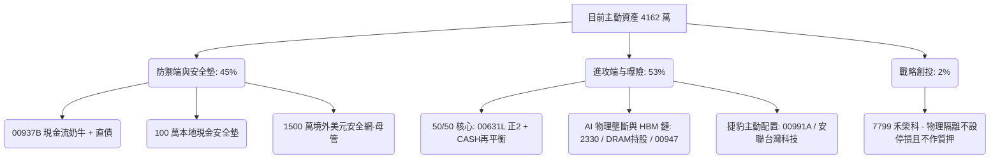

# 理財決策團隊：資產配置與目標會診診斷報告（四方會診版）

本報告由主要顧問「財經小智」協調，並彙整「指數投資愛好者」、「法人視野分析師」、「逆向風險管理師」與新加入的**「槓桿投資者（大仁）」**四方專家，針對您的資產現況、700 萬房貸資金與 5 年 1.5 億元目標進行聯合會診。

---

## 一、 實質財務數據與四方風控評估

根據客戶目前的真實數據，您的實質資產與負債現況如下：
* **期初主動投資組合市值**：41,620,539 元（含新增之 700 萬房貸）
* **房貸債務（30 年期）**：700 萬元（利率 2.5%，月還款 27,658 元，年還款約 33.2 萬）
* **證券質押債務**：群益借款 450 萬元（維持率 240%）、聯邦借款 120 萬元（維持率 >500%）
* **在地無時滯安全墊**：台幣定存 50 萬 + 高利活存 50 萬 = **100 萬新台幣**（本人直接控制）
* **外部防禦安全網**：境外美元存款 **1,500 萬美元**（由母親管理）
* **實質槓桿倍數**：**1.44 倍**（4,162 萬主動資產 / 2,892 萬淨資產）

---

## 二、 四方專家會診意見彙整

### 1. 指數投資愛好者（被動低成本視角）
*   **00646 美元資產對沖**：結合知識庫，認同 00646（元大S&P500）不避險的特質，能提供極佳的地緣政治天然對沖，比 00670L（有避險成本）更適合作為美元資產配置。
*   **00937B 現金流奶牛**：00937B 存續期間長且月配息穩定。在您目前維持率安全的前提下，建議「買入並持有」，以配息對沖 2.5% 的房貸與質押利息，實現正利差 Carry 循環。

### 2. 法人視野分析師（上游定價權與重估視角）
*   **HBM 記憶體超級週期驗證**：數據庫證實 2025 年 SK 海力士（淨利年增逾 100%）與三星電子業績均創歷史新高，記憶體產能正面臨結構性的「物理壓縮」。
*   **進攻端重組**：建議將資金由防守型債券，進一步向具備實質 HBM 定價權的記憶體龍頭、台積電（2330）、00947（IC 設計）以及規模適中能靈活避開流動性陷阱的 00991A（捷豹主動式 ETF）集中。

### 3. 逆向風險管理師（極端壓力測試與時滯防護）
*   **100 萬在地現金的臨界極限**：若群益維持率因股市大跌觸及 130% 斷頭線，補倉至安全維持率 166% 需約 **97.6 萬新台幣**。這代表這 100 萬在地現金**「僅能應付一次性且剛好踩線的追加」**。
*   **境外美元時滯與決策衝突**：境外美元匯回受制於 T+2 日斷頭限制與跨國 AML 審查（時滯），且由母親管理（決策權衝突）。建議將 1500 萬美元中的部分比例（如 50 萬美元）移轉至台灣本人名下外幣帳戶。

### 4. 槓桿投資者大仁（曝險控制與資金效率視角）
*   **破除保守迷思與 50/50 法則**：客戶目前的 00631L（正 2）配置太低（僅 57 萬），屬於「槓桿處男」配置。建議採用 50/50 槓桿法則，將台股核心部位簡化為 **50% 正 2 + 50% 現金與短債**，達到 100% 全市場曝險的同時，大跌時手握 50% 現金可隨時執行再平衡加碼。
*   **700 萬房貸為黃金借貸溢酬**：這筆 30 年期長期低息（2.5%）負債無 Margin Call 風險，是完美的 Carry Trade 工具，**絕對不要提前還款**，應全數投入高效率的曝險資產以時間換空間。
*   **7799 禾榮科從聯邦質押中「清爽隔離」**：大仁指出，既然要將 7799 物理隔離，**將它拿去聯邦質押作為擔保品是致命的錯誤**！興櫃生技無流動性，等於在防線中埋下定時炸彈。強烈建議將 7799 從聯邦質押中移出，改用台積電（2330）或大盤 ETF 做擔保品，讓創投部位回歸純粹的物理隔離。

---

## 三、 主要顧問（財經小智）最終會診決策藍圖

為平衡各專家的觀點，主要顧問提出以下最終配置優化路徑：

### 1. 負債端與安全網優化
*   **7799 禾榮科清爽隔離**：立即將 7799 禾榮科從聯邦質押擔保品中移出，改以台積電（2330）或市值型 ETF 代替，落實真正的物理隔離，避免在興櫃市場爆發流動性危機時引發連鎖斷頭。
*   **動態維持率防禦**：調配部分台幣現金，將群益的維持率主動提升至 **300% 以上**。

### 2. 進攻端與曝險最佳化
*   **台股核心 50/50 最佳化**：清理台股零散個股，將台股部位逐步轉換為 **50% 00631L（正 2） + 50% 00937B（現金流奶牛）與短債** 的配置，以曝險控制風險。
*   **500 萬房貸資金部署**：待科技板塊出現 10%-15% 健康修正、台積電回測至法人囤貨區時分批買入，分配為 60% 台積電（2330）現貨，40% 00991A（捷豹主動式 ETF）。

### 3. 啞鈴配置終極圖

